# ΕΙΣΑΓΩΓΗ


Είναι σύνηθες πλέον να χρησιμοποιούμε τεχνικές τεχνητής νοημοσύνης για να
διευκολύνουμε την καθημερινότητα μας ή και να βρίσκουμε λύσεις σε προβλήματα
όπου ένα ανθρώπινο μυαλό θα ήταν αρκετά χρονοβόρο έως και αδύνατον να δώσει. Η
ανάγκη για την δημιουργία  μοντέλων  τα οποία λειτουργούν ως ταξινομητές προήλθε
από το γεγονός ότι έχουν πληθώρα εφαρμογών.
Αυτό που καλούμαστε εμείς να κάνουμε είναι έχοντας στα χέρια μας εικόνες 2
κατηγόριων (Γάτες - Σκύλοι) να φτιάξουμε ένα ταξινομητή ο οποίος θα μπορεί να
ταξινομεί καινούργιες εικόνες.

Η τεχνική που θα χρησιμοποιήσουμε ονομάζεται Bag of visual words. Στη ''σακούλα
λέξεων'' τοποθετούμε χαρακτηριστικά τα οποία εξάγαμε από διάφορες εικόνες
συγκεκριμένης κατηγορίας. Στην προκειμένη εργασία χρησιμοποιήσαμε 3 διαφορετικές
τεχνικές για την εξαγωγή χαρακτηριστικών από μια εικόνα.

    1) SIFT.
    2) ORB.
    3) SURF.

Αφού τρέξουμε τους παραπάνω αλγορίθμους στο train set  και έχουμε ένα σύνολο
λέξεων για την κάθε κατηγορία μια καλή πρακτική είναι να μειώσουμε το μέγεθος
του λεξικού. Πως θα το κάνουμε αυτό; Χρησιμοποιώντας κάποιον αλγόριθμο
συσταδοποίησης στα χαρακτηριστικά που εξάγαμε από τις εικόνες . Με αυτόν τον
τρόπο θα κρατήσουμε μόνο τα κέντρα των clusters , και έτσι θα έχουμε
ελαχιστοποίηση το σύνολο των λέξεων στο λεξικό μας.

Το επόμενο βήμα είναι να φτιάξουμε το ιστόγραμμα μας. Σε  μια καινούργια εικόνα
(στην οποία πχ ο SIFT μας επιστρέψει 128 τιμές)  παίρνουμε την απόσταση των
τιμών αυτών με τις λέξεις από το λεξικό μας και σημειώνουμε πια ήταν η πιο
κοντινή. Αφού πλέον ξέρουμε με πια λέξη ταιριάζει πιο πολύ η καινούργια μας
εικόνα ξέρουμε και σε πια κατηγορία θα ανήκει.

Ας δούμε ένα παράδειγμα τις διαδικασίας.

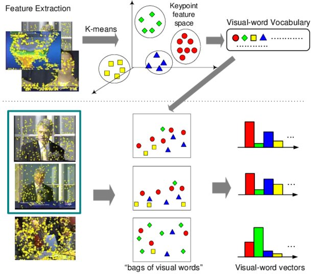


# Μέθοδοι που εφαρμόστηκαν

Θα χρησιμοποιήσουμε 2 αλγόριθμους συσταδοποίησης. Ο ένας είναι
**MiniBatchKMeans** ο οποίος είναι σε θέση να διαχειριστεί μεγάλη κλίμακα
χαρακτηριστικών και ο άλλος είναι ο **MeanShift** τον οποίο δεν κατάφερα να
τρέξω για όλο το σύνολο των εικόνων και για αυτό τον έτρεξα για 10 εικόνες από
την κάθε κλάση.

Για να μετρήσουμε την απόδοση του κάθε μοντέλου θα χρησιμοποιούμε τις παρακάτω
συναρτήσεις.

    1. Precision: πόσα από τα παραδείγματα που το μοντέλο υπολόγισε ότι ανήκαν στην ομάδα Χ, ανήκαν όντως στην ομάδα Χ.
    2. Recall: από το σύνολο των παραδειγμάτων που ανήκαν στην ομάδα Χ, πόσα ανέκτησε το μοντέλο.
    3. F1 score: αρμονικός μέσος των precision και recall. Βοηθά στο να έχουμε μια γενική ιδέα της απόδοσης του μοντέλου.

## **k-Nearest Neighbors**

Η μέθοδος των k-Πλησιέστερων Γειτόνων(k-Nearest Neighbors - kNN) είναι ένας
αλγόριθμος της οικογένειας των Κατηγοριοποιητών Βασισμένων σε Παραδείγματα.

Για λόγους απλότητας θεωρούμε αρχικά ένα πρόβλημα κατηγοριοποίησης, όπου οι
παρατηρήσεις αποτελούνται από δύο αριθμητικά πεδία και το γνώρισμα της
κλάσης.Κάθε παρατήρηση μπορεί να θεωρηθεί ως ένα σημείο στον χώρο των δύο
διαστάσεων. Μια παρατήρηση Χ απέχει από μια άλλη παρατήρηση Υ, απόσταση d(X,Y)
μέσα στον δισδιάστατο χώρο. Η απόσταση d(X,Y) μπορεί να υπολογιστεί ως η
Ευκλείδεια απόσταση.

Εστω οτι εχουμε προς ταξινομηση τα 8 παρακατω σημεια:
A1=(2,10), A2=(2,5), A3=(8,4), A4=(5,8),
A5=(7,5), A6=(6,4), A7=(1,2), A8=(4,9) και εχουμε επιλεξει οτι τα σημεια αυτα
θελουμε να τα καταταξουμε σε 3 ομαδες.

Τα βήματα του αλγορίθμου είναι τα εξής :
1. Διαχωρισμός των δεδομένων σε δεδομένα εκπαίδευσης και δεδομένα ελέγχου.
2. Επιλογή μιας τιμής Κ.
3. Καθορισμός μετρικής απόστασης (π.χ. Ευκλείδεια , Manhattan, Hamming κ.α)
4. Επιλογή ενός δείγματος από το training set που πρέπει να ταξινομηθεί και
υπολογισμός τηςαπόστασης από τα δεδομένα εκπαίδευσης. Ταξινόμηση των αποστάσεων
και επιλογή των Κ-πλησιέστερων δεδομένων.
5. Ανάθεση κλάσης στο δεδομένο ελέγχου με βάση την πλειοψηφία των κ γειτόνων
του.

Το πρώτο βήμα είναι να υπολογίσουμε την ευκλείδεια απόστασή των σημείων Α1, Α4
και Α7 με όλα τα υπόλοιπα σημεία. Αφου υπολογίσουμε την απόσταση βλέπουμε από
ποιο σημείο έχει την μικρότερη απόσταση το κάθε στοιχείο και το κατατάσουμε στην
ομάδα.

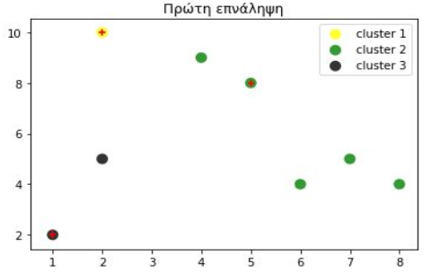


Το δεύτερο βήμα είναι να υπολογίσουμε την μέση τιμή για τα x1, x2 της κάθε
ομάδας. Και ναορίσουμε το αποτέλεσμα ως νέο κέντρο της συστάδας.

    cluster 1 : (2, 10)
    cluster 2: (6, 6)
    cluster 3: (1.5, 3.5)

Υπολογίζουμε την ευκλείδεια απόσταση των σημείων από τα νέα κέντρα

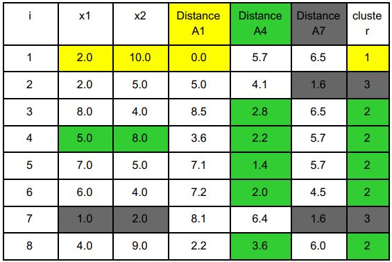
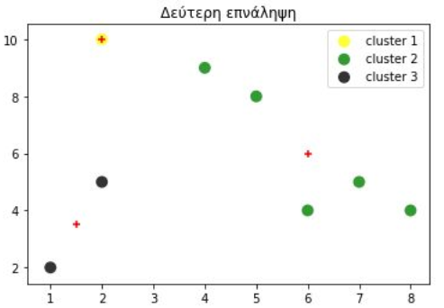

Μετά το τέλος της τρίτης εποχής οι συσταδες θα ειναι
με νεα κεντρα C1(3,9.5), C2=(6.5, 5.25) και C3=(1.5, 3.5)

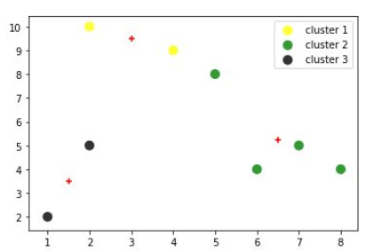

μετά την τέταρτη επανάληψη τα νέα κέντρα θα είναι C1(3.66 ,9), C2=(7, 4.33) και C3=(1.5, 3.5)

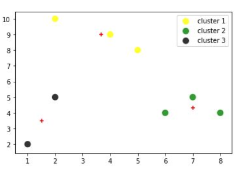

**Τα πλεονεκτήματα των K-means είναι:**
1. Εύκολος στην κατανόηση και στην χρήση
2. Αποδοτικός: Πολυπλοκότητα Ο(tkn) όπου n είναι το σύνολο των δεδομένων, k
είναι αριθμός των συστάδων, t είναι ο αριθμός των επαναλήψεων.
3. Αν το k και το t είναι μικρά ο κ-means θεωρείται γραμμικός αλγόριθμος.

**Τα μειονεκτήματα των δέντρων απόφασης είναι:**
1. Ο αλγόριθμος εφαρμόζεται μόνο εάν ο μέσος όρος ορίζεται.
2. Ο χρήστης πρέπει να καθορίσει το k.
3. Το αποτέλεσμα εξαρτάται από την επιλογή των αρχικών σημείων
4. Ο αλγόριθμος είναι ευαίσθητος σε outliers.
5. Ο αλγόριθμος k-μέσων δεν είναι κατάλληλος για την ανεύρεση clustersπου δεν
είναι hyper-ellipsoids (or hyper-spheres)

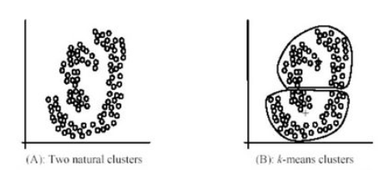

## Mean shift

Ο Mean Shift Αλγόριθμος αντιπροσωπεύει γενικά μια μη παραμετρική λειτουργία
ομαδοποίησης.  Η  κύρια  ιδέα  πίσω  από  τον  Mean  Shift αλγόριθμο  είναι  η
αντιστοίχιση  των  σημείων  ενός  d-διάστατου  χώρου  σε μια  εμπειρική
συνάρτηση πυκνότητας πιθανότητας. Έτσι μια πυκνή , από σημεία , περιοχή του
d-διάστατου χώρου αντιστοιχεί σε κάποιο τοπικό μέγιστο της επικείμενης αυτής
κατανομής και γενικά  τα  υπόλοιπα  σημεία  του  χώρου  αντιστοιχούν  σε  μία
κλίση  αυτής  της κατανομής  με  τάση  την  σύγκλιση  τους  προς  το  τοπικό
μέγιστο.  Τα  σημεία  των δεδομένων που συνδέονται  , τουλάχιστον κατά
προσέγγιση , με τα σταθερά σημεία της κατανομής θεωρούνται μέλη του ίδιο
cluster.

Το σημαντικότερο πλεονέκτημα του αλγόριθμου MeanShift, σε σχέση με τον k-means,
είναι ότι δεν απαιτείεκ των προτέρων γνώση τουαριθμούτων ομάδων στον οποίο θα
χωριστούν τα δεδομένα. Ο αλγόριθμος σχηματίζει απροσδιόριστης μορφής ομάδες
δεδομένων με βάση την τοπολογία τους. Συνοπτικά, η διαδικασία που ακολουθείται
είναι η εξής: αρχικά δημιουργείται ένα  “παράθυρο”  με  συγκεκριμένη  ακτίνα
για  κάθε  ένα  από  τα  διανύσματα  που αντιπροσωπεύουν τα δεδομένα και τα
οποία αποτελούν το κέντρο αυτών των παραθύρων. Έπειτα, για κάθε παράθυρο
υπολογίζεται το αντίστοιχο meanshiftδιάνυσμα, του οποίου η διεύθυνση αντιστοιχεί
στην μέγιστη αύξηση της τοπικής συνάρτησης πυκνότητας. Στη συνέχεια το  κάθε
παράθυρο  μετακινείται  σύμφωνα  με  αυτό  το  διάνυσμα.  Η  διαδικασία
επαναλαμβάνεται μέχρι τα παράθυρα να τοποθετηθούν στην περιοχή που αντιστοιχεί
στο τοπικό μέγιστο της συνάρτησης πυκνότητας.

Τα βήματα του αλγορίθμου είναι τα εξής :

1. Αρχικά το κάθε διάνυσμα αποτελεί το κέντρο μιας ομάδας.

2. Ο αλγόριθμος δέχεται ως είσοδο δύο παραμέτρους, τις Τ1 και Τ2, με την πρώτη
να αποτελεί την τιμή της ακτίνας των παραθύρων και τη δεύτερη το κατώφλι σύμφωνα
με το οποίο αν η απόσταση δύο παραθύρων είναι μικρότερη από αυτό,αυτά να
ενοποιούνται και να συνθέτουν μία νέα ομάδα.

3. Υπολογισμός του mean shift διανύσματος κάθε ομάδας προσθέτοντας τα στοιχεία
που την αποτελούν. Το διάνυσμα αυτό κανονικοποιείται και αποτελεί το κέντρο της
ομάδας, ενώ στη συνέχεια επιτελείται  η ενοποίηση κάποιων ομάδωνσύμφωνα με την
τιμή Τ2.

4. Επιστροφή στο Βήμα 2 και επανάληψη της διαδικασίας, για τις ίδιες τιμές
Τ1καιΤ2,σύμφωνα με τις νέες ομάδες που δημιουργήθηκαν.

5. Ο αλγόριθμοςτερματίζει όταν το meanshift διάνυσμα της κάθε ομάδας έχει
μικρότερο μέτρο από ένα όριο προκαθορισμένο από τον χρήστη.

Αφου εχουμε τρεξει τους αλγοριθμους συσταδοποιησης και εχουμε ετοιμα τα λεξικα
μας, ειμαστε σε θεση πλεον να χρησημοποιοντας τα παρακατω μοντελα αποφασης να
προβλεπουμε σε ποια κατηγορια ανοικει μια καινουργια εικονα.

## **Decision Trees**

Μια ευρέως χρησιμοποιούμενη μέθοδοςμηχανικής μάθησης είναι εκείνη που βασίζεται
σε δένδρα απόφασης. Κατά την συγκεκριμένη μέθοδο, επιχειρείται η προσέγγιση μιας
κατηγορικής συνάρτησης στόχου, ακολουθώντας την τεχνική του «διαίρει και
βασίλευε» (Divide and Conquer).Ο χώρος του προβλήματος χωρίζεται σε περιοχές από
στιγμιότυπα που φέρουν την ίδια τιμή ως προς κάποια μεταβλητήχαρακτηριστικό, και
η διαδικασία επαναλαμβάνεται αναδρομικά, αναπαριστώντας με τον τρόπο αυτό το
παραγόμενο μοντέλο ως δένδρο απόφασης.
Το δέντρο απόφασης  είναι  ένας  γράφος  με  την  κλασική  δενδρική  δομή όπου
διακρίνουμε: (α) έναν αρχικό κόμβο, τη ρίζα, (β) τους εσωτερικούς κόμβουςκαι (γ)
τους εξωτερικούς κόμβους, τα φύλλα. Σε κάθε κόμβο (εσωτερικό ή εξωτερικό) εκτός
της ρίζας εισέρχεται μιακατευθυνόμενη ακμή από έναν άλλο κόμβο. Σε κάθε
εσωτερικό κόμβο αντιστοιχεί ένα χαρακτηριστικό που χρησιμοποιείται για περαιτέρω
διαχωρισμό του δέντρου. Στις ακμές που εξέρχονται από τη ρίζα ή κάθε εσωτερικό
κόμβο, αντιστοιχεί μιασυνθήκη ελέγχου με βάση το διαχωριστικό χαρακτηριστικό. Η
διαδικασία κατασκευής ενός δέντρου απόφασης είναι επαναληπτική και μπορεί να
περιγραφεί συνοπτικά ως ακολούθως: Αρχικά,επιλέγουμε ένα χαρακτηριστικό, το
οποίο αναφέρεται στη ρίζα του δέντρου,και,στη συνέχεια,κατασκευάζουμε μιαακμή
και  ένανκόμβο  για  καθεμία  από  τις  διακριτές  τιμές  του χαρακτηριστικού.
Αυτά τα δύο βήματα επαναλαμβάνονται συνεχώς, μέχρις ότου όλα τα χαρακτηριστικά
να εισαχθούν στους κόμβους του δέντρου.


**Τα πλεονεκτήματα των δέντρων απόφασης είναι:**
1. Τα δέντρα απόφασης κάνουν ταξινόμηση χωρίς να χρειάζεται μεγάλη υπολογιστική
ισχύς.
2. Τα δέντρα απόφασης παράγουν κατανοητούς κανόνες.
3. Τα δέντρα απόφασης δίνουν μια σαφή ένδειξη για το ποια πεδία είναι πιο
σημαντικά στην πρόβλεψη ή στην ταξινόμηση.

**Τα μειονεκτήματα των δέντρων απόφασης είναι:**
1. Τα δέντρα απόφασης είναι λιγότερο κατάλληλα για διαδικασίες εκτίμησης στις
οποίες ο στόχος είναι να προβλέψουν την τιμή μιας συνεχούς μεταβλητής.
2. Τα δέντρα απόφασης είναι επιρρεπή σε σφάλματα σε προβλήματα ταξινόμησης με
μεγάλο αριθμό κλάσεων.
3. Τα δέντρα απόφασης μπορεί να έχουν υψηλό υπολογιστικό κόστος.

## **Support Vector Machines**

Μηχανές Διανυσμάτων Υποστήριξης Οι  Μηχανές  Διανυσμάτων  Υποστήριξης (ΜΔΥ)
(Support  Vector  Machines(SVM))  προτάθηκαν  από  τον Vapnik (1995) και γρήγορα
γνώρισαν μεγάλη διάδοση λόγω της στιβαρής θεωρητικής θεμελίωσης τους και των
υψηλων επιδόσεων τους. Τα svm αποτέλεσαν αντικειμενο ενδιαφεροντος πολλων
ερευνητων και εφαρμοστηκαν για την αναπτυξη μοντελων σε πληθος προβληματων
κατηγοριοποιησης.
Βασικη ιδεα των SVM ειναι η κατασκευη ενος υπερεπιπεδου (hyperplane), το οποιο
διαχοριζει τις κλασεις και λειτουργει ως συναρτηση αποφασης. Οι νεες
παρατηρησεις κατηγοριοποιουνται αναλογα με την πλευρα του υπεριπιπεδου στην
οποια βρισκονται. Ας θεωρησουμε μια απλη περιπτωση οπου τα σημεια ειναι γραμμικα
διαχωρισιμα.

```python
import numpy as np
import matplotlib.pyplot as plt
import seaborn as sns; sns.set()

X = np.array([[0.5, 1],
                [1, 0.5],
                [1, 1.5]])
y = np.array([1,1,0])

# print possible solutions
xfit = np.linspace(0, 2)
plt.scatter(X[:, 0], X[:, 1], c=y, s=50, cmap='autumn');
plt.plot([1], [1.18], 'x', color='red', markeredgewidth=2, markersize=10)
for m, b in [(-0.4, 1.6), (-1.5, 2.5), (0, 1.3)]:
    plt.plot(xfit, m * xfit + b, '-k')
plt.show()
```

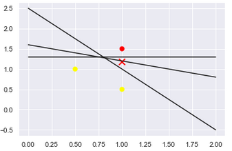

 Ένας απλός ταξινομητής θα προσπαθούσε να σχεδιάσει μια γραμμή διαχωρίζοντας τα
δύο σύνολα δεδομένων και έτσι να δημιουργήσει ένα μοντέλο ταξινόμησης.

 Aμέσως βλέπουμε ένα πρόβλημα: υπάρχουν περισσότερες από μία πιθανές
διαχωριστικές γραμμές που μπορούν τέλεια να κάνουν διακρίσεις μεταξύ των δύο
κλάσεων. Ανάλογα με την ευθεία που επιλέξαμε βλέπουμε το σημείο x κατατάσσεται
δυο φορές στην κλάση + και μια φοράστην κλάση  - .

Χρησιμοποιώντας ένα SVM θα βρούμε εκείνη την ευθεία η οι οποία έχει την
μεγαλύτερη απόσταση από τα support vectors της κάθε κλάσης.

```python
def plot_svc_decision_function(model, ax=None):
    """Plot the decision function for a 2D SVC"""
    if ax is None:
        ax = plt.gca()
    xlim = ax.get_xlim()
    ylim = ax.get_ylim()

    # create grid to evaluate model
    x = np.linspace(xlim[0], xlim[1], 30)
    y = np.linspace(ylim[0], ylim[1], 30)
    Y, X = np.meshgrid(y, x)
    xy = np.vstack([X.ravel(), Y.ravel()]).T
    P = model.decision_function(xy).reshape(X.shape)
    # plot decision boundary and margins
    ax.contour(X, Y, P, colors='k',
               levels=[-1, 0, 1], alpha=0.5,
               linestyles=['--', '-', '--'])
    ax.set_xlim(xlim)
    ax.set_ylim(ylim)
    
```

```python
#train the model
from sklearn.svm import SVC # "Support vector classifier"
model = SVC(kernel='linear', C=1E10)
model.fit(X, y)
#Find the descision boundary
w = model.coef_[0]
a = -w[0] / w[1]
b = -(model.intercept_[0]) / w[1]
str = "y= {}*x".format(int(a)) +  "{0:+d}".format(int(b))

plt.scatter(X[:, 0], X[:, 1], c=y, s=50, cmap='autumn')
plt.text(0.8, 1.25, str, fontsize=12,
             rotation=-15, rotation_mode='anchor')
plot_svc_decision_function(model);

```
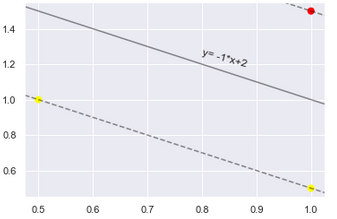

# Dataset

Τις εικόνες με τις γάτες και σκύλους μπορούμε να τις καταβάσουμε απο αυτόν τον σύνδεσμο [Cats & dogs dataset](https://www.microsoft.com/en-us/download/details.aspx?id=54765)

H δομή:   
   
```bash
C:.
└───80_20
    ├───Test
    │   ├───Cat
    |   |    ├─── 0000.jpg
    │   └───Dog
    |        ├─── 0000.jpg
    ├───Train
    │   ├───Cat
    |   |    ├─── 0000.jpg
    │   └───Dog
    |        ├─── 0000.jpg
    └───Validation
        ├───Cat
        |    ├─── 0000.jpg
        └───Dog
             ├─── 0000.jpg
```
# Αποτελέσματα

Στην διάθεση μας έχουμε εικόνες από σκύλους και γάτες. Παρακάτω εμφανίζουμε ένα
δείγμα από αυτές:

<table>
  <tr>
    <td></td>
     <td></td>
  </tr>
  <tr>
    <td>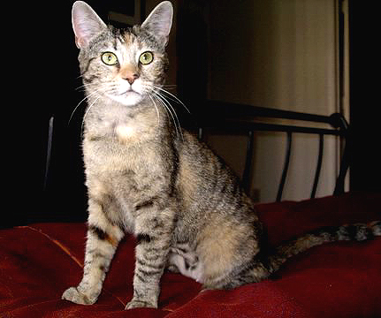</td>
    <td></td>\\
  </tr>
 </table>
 
 <table>
  <tr>
    <td></td>
     <td></td>
  </tr>
  <tr>
    <td>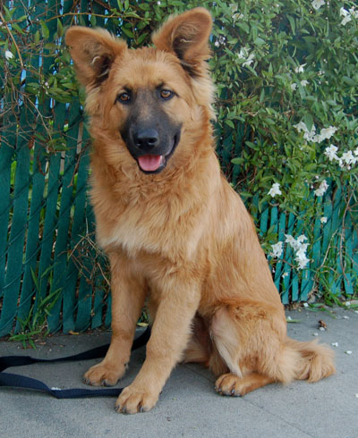</td>
    <td>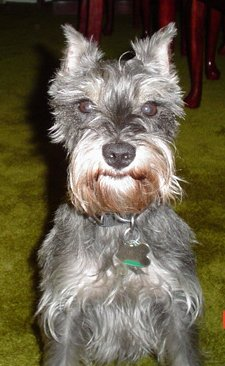</td>
  </tr>
 </table>

## Κ Means - 500 images

## train set

Αφού ο **MiniBatchKMeans** είναι σε θέση να διαχειριστεί μεγάλη κλίμακα
δεδομένων κατάφερα να πάρω ένα bag of words για 500 εικόνες **γατών** και 500
εικόνες **σκύλον**.
Πάμε πρώτα να δούμε τα αποτελέσματα για το train set.

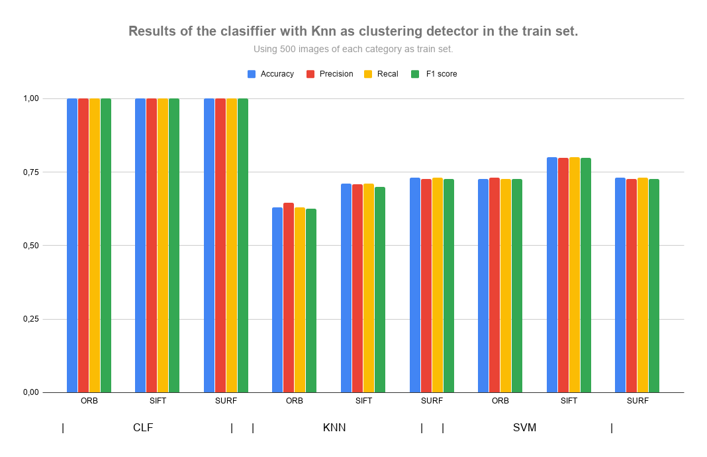

Είναι γνωστό ότι το μοντέλο σε εικόνες με τις οποίες έχει εκπαιδευτεί εμφανίζει
πολύ καλά αποτελέσματα αν και δεν είναι αντιπροσωπευτικά. Στο παραπάνω διάγραμμα
βλέπουμε ότι το **CLF** κατάφερε να βρει όλα τα αποτελέσματα και με τις 3
τεχνικές εξαγωγής χαρακτηριστικών και με το **SVM** να τον ακολουθεί με ποσοστό
επιτυχίας περίπου 75%.

## test set

Πάμε λοιπόν να δούμε πως αντιμετωπίζει το μοντέλο μας εικόνες τις οποίες δεν
έχει ξαναδεί.

Αποτέλεσμα για test set 100 εικόνων.


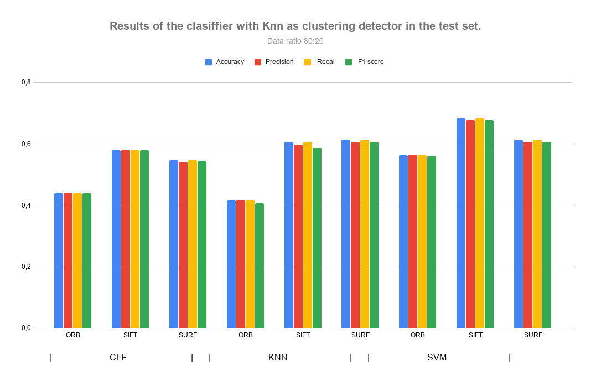

Το καλύτερο αποτέλεσμα το έχουμε για συνδυασμό **SVM - SIFT**.

Ας δούμε τα αποτελέσματα data ratio 60:40


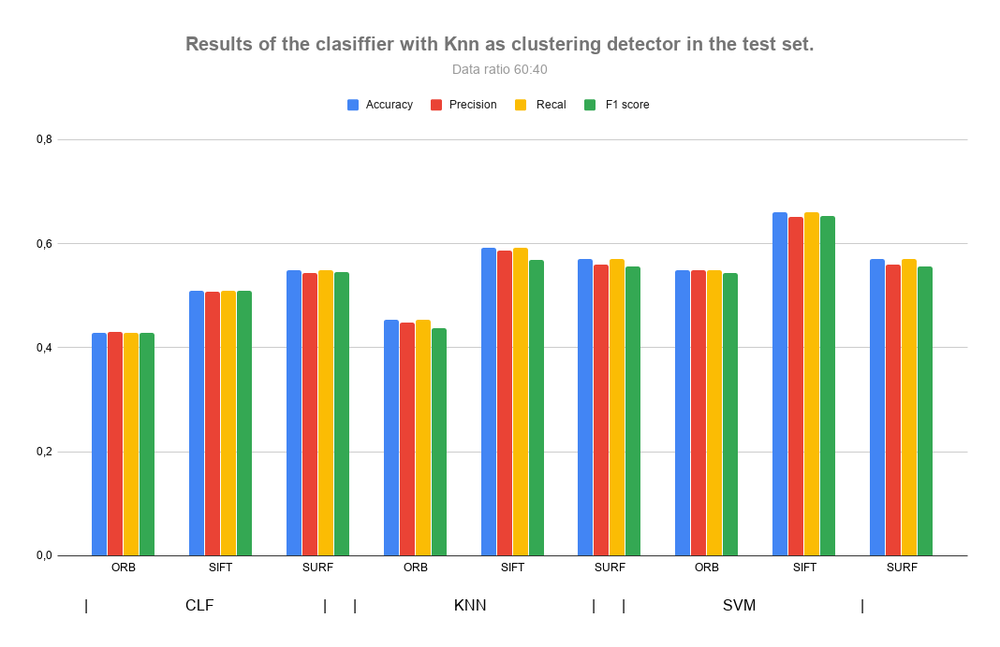

Και πάλι το καλύτερο αποτέλεσμα το έχουμε για συνδυασμό **SVM - SIFT**. Επίσης
παρατηρούμε μια μικρή μείωση σε όλα τα αποτελέσματα των άλλων scores.
Καταλαβαίνουμε λοιπών για άλλη μια φορά πόσο σημαντικό είναι να έχουμε στα χεριά
μας πολλά δεδομένα για την εκπαίδευση.

# 10 images

Όπως αναφέραμε και πιο πάνω μόνο ο k_means είναι σε θέση να χωρίζει τα δεδομένα
σε batches, για να καταφέρω να τρέξω και άλλων αλγόριθμο συσταδοποίησης μείωσα
την ποσότητα των δεδομένων.

## train set

Πάμε πρώτα να δούμε τα αποτελέσματα για το train set για τον **k means**.

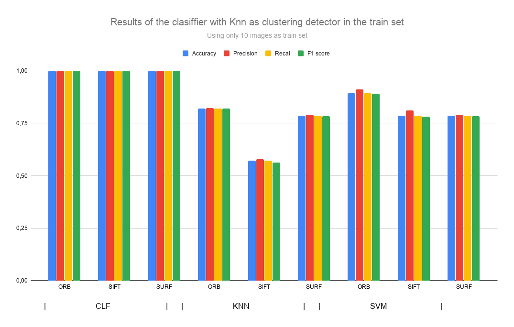

Βλέπουμε ότι έχουμε παρόμοια αποτελέσματα με τις 500 εικόνες, με μια μικρή
αύξηση των scores και τον **ORB** να δίνει τα καλύτερα αποτελέσματα.

Ας συγκρίνουμε τα αποτελέσματα  για το train set με τον **Mean shift**.

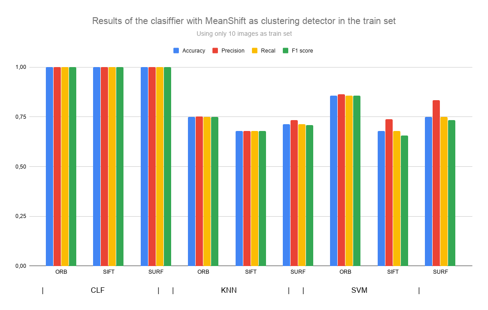

Πέραν του clf και του συνδυασμού **svm - orb** παρατηρούμε ότι όλα τα υπόλοιπα
scores είναι ελάχιστα μειωμένα.

## test set
Αποτέλεσμά για test set 100 εικόνων.

**k means**.
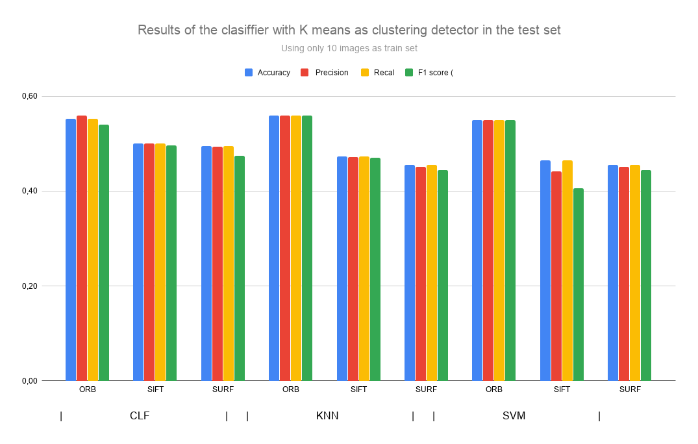

Βλέπουμε ότι ο **ORB** και πάλι δίνει τα καλύτερα αποτελέσματα.

**Mean shift**
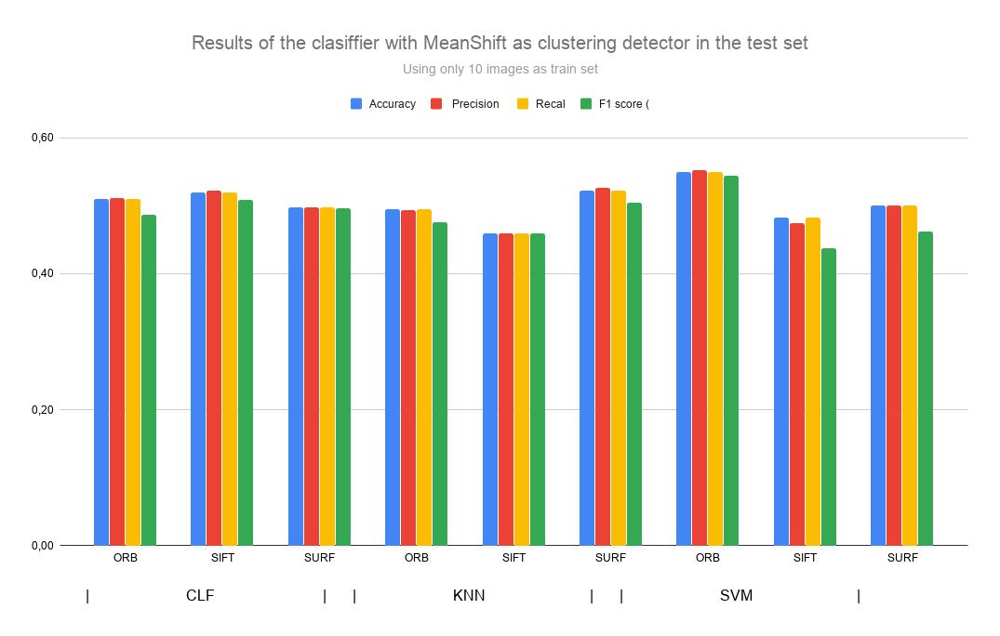

Βλέπουμε ότι ο συνδυασμός **SVM - ORB** και πάλι δίνει τα καλύτερα αποτελέσματα.

# Συμπεράσματα

Από τα παραπάνω αποτελέσματα παρατηρούμε ότι το μοντέλο το οποίο εκπαιδεύτηκε με
500 εικόνες από την κάθε κατηγορία είχε scores κατα 10% μεγαλύτερα από τα
μοντέλα τα οποία εκπαιδευτήκαν με 10 εικόνες. Το καλύτερο αποτέλεσμα το οποίο
λάβαμε ήταν από το μοντέλο το οποίο έτρεξε για τις 1000 εικόνες με τον συνδυασμό
**SVM – SIFT** . Επίσης παρατηρήσαμε ότι ο **ORB** μας έδωσε τα καλύτερα
αποτελέσματα για τα μοντέλα τα οποία έτρεξαν για 20 εικόνες.
